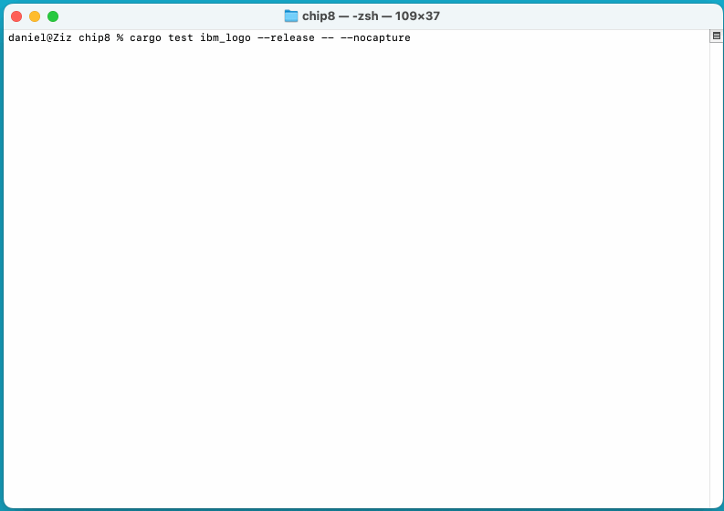
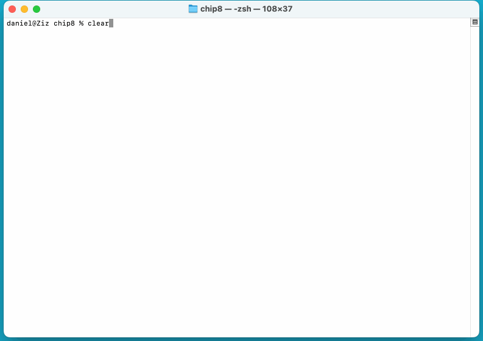
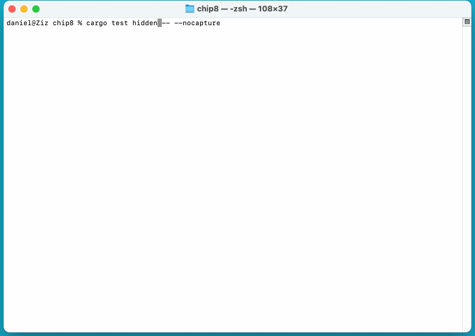

# A [Chip8](https://en.wikipedia.org/wiki/CHIP-8) interpreter library

## Usage

The main api is `chip8::Interpreter`.

- load a rom: `interpreter.load_program_from_path("my_chip8.ch8")?`
- execute an instruction: `interpreter.execute_current_instruction()`
- get the display's state: `interpreter.display()`

# Features

- `crossterm` feature allows for executing chip8 programs in the terminal using the [crossterm](https://crates.io/crates/crossterm) crate.
  - To disable put this in your `Cargo.toml`
  ```
  [dependencies]
  chip8 = { git = "https://github.com/daniel-j-anderson-dev/chip8.git", default-features = false }
  ```

## Example ROM execution in terminal

IBM logo
- 


Fishie
- 

Hidden (not functioning properly)
- 

## How to run programs in terminal

Execute an included Chip8 program in the terminal: `cargo test included_program`.

Execute any Chip8 program in the terminal: `cargo test user_program`. (prompts the user for a chip8 program path)

## Included Programs
- `pong_2`
- `hires_stars`
- `paddles`
- `hires_particle_demo`
- `puzzle_15_alt`
- `ch8_logo`
- `ibm_logo`
- `kaleidoscope`
- `hi_lo`
- `guess`
- `submarine`
- `jumping_x_and_o`
- `soccer`
- `zero_pong`
- `puzzle`
- `division_test`
- `bmp_viewer_hello`
- `blitz`
- `most_dangerous_game`
- `life`
- `hidden`
- `brix`
- `pong_alt`
- `nim`
- `reversi`
- `blinky`
- `tapeworm`
- `blinky_alt`
- `missile`
- `squash`
- `breakout`
- `breakout_brix`
- `tic_tac_toe`
- `space_intercept`
- `maze_alt`
- `space_flight`
- `tron`
- `vertical_brix`
- `animal_race`
- `hires_s_triangle`
- `tetris`
- `sierpinski`
- `space_invaders`
- `astro_dodge_hires`
- `spooky_spot`
- `fishie`
- `astro_dodge`
- `bowling`
- `connect_4`
- `mastermind_4_row`
- `random_number_test`
- `sum_fun`
- `time_bomb`
- `delay_timer_test`
- `slide`
- `keypad_test`
- `framed_mk2`
- `trip_8_demo`
- `rush_hour_alt`
- `framed_mk1`
- `lunar_lander`
- `syzygy`
- `tank`
- `rush_hour`
- `deflection`
- `brick_brix`
- `wipe_off`
- `worm_v4`
- `programmable_space_fighters`
- `figures`
- `addition_problems`
- `sqrt_test`
- `space_invaders_alt`
- `ch8_picture`
- `stars`
- `min_game`
- `pong_1_player`
- `coin_flip`
- `ufo`
- `guess_alt`
- `rocket_launch`
- `zero_demo`
- `filter`
- `shooting_stars`
- `hires_test`
- `vers`
- `wall`
- `sierpinski_alt`
- `maze`
- `craps`
- `rocket_launcher`
- `puzzle_15`
- `particle_demo`
- `clock`
- `x_mirror`
- `merlin`
- `pong`
- `landing`
- `airplane`
- `biorhythm`
- `cave`
- `sequence_shoot`
- `hires_maze`
- `rocket`
- `hires_worm_v4`
- `trip_8_hires_demo`
- `russian_roulette`

## Resources used

- [Awesome Chip8](https://chip-8.github.io/links/)
- [Guide to making a CHIP-8 emulator](https://tobiasvl.github.io/blog/write-a-chip-8-emulator)
- [Building a CHIP-8 Emulator [C++]](https://austinmorlan.com/posts/chip8_emulator/)
- [Wikipedia](https://en.wikipedia.org/wiki/CHIP-8)
